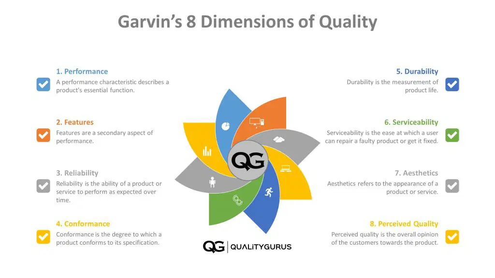
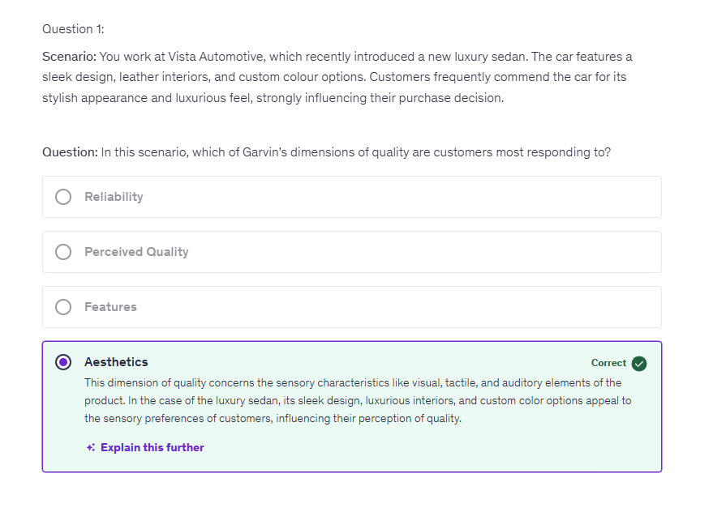
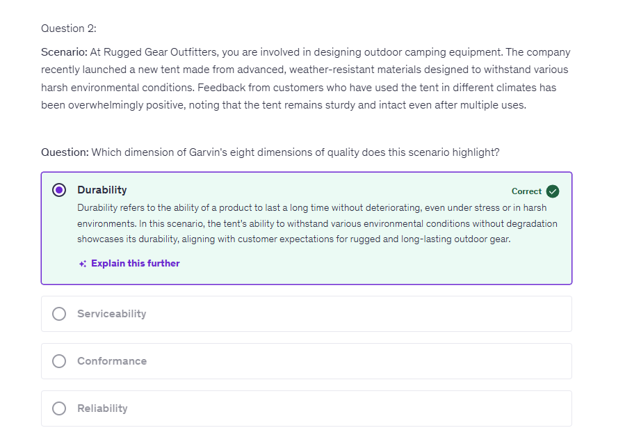
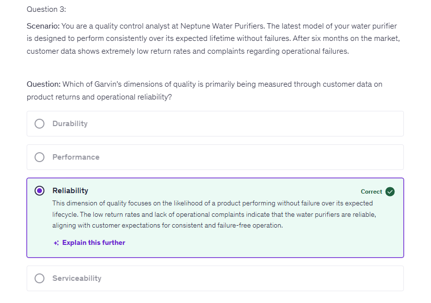

# Quality Management Basics

## Welcome and Course Objectives

## Quality Management for Everyone

* Join a simplified quality management learning
journey for all levels in an organization, from
factory to executives.
* This course covers essential concepts that are the
cornerstone of organizational success, revealing
how Quality Management and effective leadership
create an environment that drives excellence.
* To help your company succeed and grow, it's
important to focus on mastering the key elements
of Quality Management, no matter what your role
may be.

## Course Objectives

* **Understand the Fundamentals of Quality Management:** Grasp core
concepts, differentiate between quality in manufacturing and
services, and trace the evolution of quality management.

* **Implement Quality Management Systems (QMS):** Learn ISO
9001:2015, build and implement a QMS, and foster a culture of
quality with effective leadership.

* **Learn from Quality Gurus:** Study the contributions and principles
of Edwards Deming, Joseph Juran, Philip Crosby, and other
influential quality thought leaders.

* **Apply Quality Tools and Techniques:** Master the Seven Basic
Quality Tools, Lean methodologies, and Six Sigma for process
improvement.

* **Measure and Enhance Quality Performance:** Understand and
measure the cost of quality, use key performance metrics and
indicators, and recognize the importance of quality awards and
recognitions.

> Take print of Activity book and write down in space

## How to Get the Most Out of This Course?

* Active participation is key; immerse yourself in the
course materials and participate in all activities.
* Reflect on how Quality Management principles can
be adapted to your professional environment or
personal projects.
* Take time to consider what you've learned and
connect it with your professional objectives and
aspirations.
* Utilize all provided resources, such as readings and
case studies, to expand your knowledge.

```txt
There are a lot of things to learn in this course and as I earlier said, I will try to keep things
very simple which are easy to understand for everyone in the organization.
So let's start with the first section, which is Fundamentals of Quality Management.
During this learning, be curious.
Be eager to learn new knowledge.
```

## What is Quality?

* Quality is commonly defined as the standard of
something as measured against other things of a similar
kind; the **degree of excellence of something.**

```txt
Let us say if we have a phone.
This could be iPhone, this could be any other phone.
So when we say quality, basically what we are doing is we are comparing two things or more things and
we make judgment based on that, that as against everything else, as against every other phone.
How does our phone compete with them?
How does our phone perform?
That is quality in one way to say that, now quality is basically a degree of excellence.
```


* According to ISO 9000:2015, quality is the **"degree to which a set of inherent characteristics of an object fulfills requirements."**
* At its core, quality represents the features and
characteristics that determine a product's or service's
ability to satisfy stated or implied needs.
> But at the core of this quality represents the customer satisfaction, how much this particular product or service is able to satisfy the customer's needs.

* In practice, quality can vary based on perspective:
consumers may focus on the end result, while
manufacturers might emphasize the production
process.

```txt
And I have done this exercise where I have asked people in an open session that what does quality mean
for them?

And if you do that, you would see that everyone has a different definition of quality.
Some people will say that quality is that that particular thing should be looking good.
Somebody will say that that particular thing should be more durable, that should make client happy,
and so on.
So quality has many definition for many people.
```

```txt
Now one thing which we need to do is when we are implementing quality management, we need to have a
better understanding of what is quality in your context, in your organization.

When you want to implement quality management system in your organization, you need to have a clear
understanding of what quality means to you, what quality means to your company.
```

```txt
Now, one thing which we have seen here is the formal definition of ISO 9000.
Another way to look at this is looking at the various dimensions of quality, and that is what we will
be doing in the next video where we will be talking about Garvin's eight dimensions of quality.
That will open up your mind more to understand what quality would mean for different people.
```

## Garvin's Eight Dimensions of Quality

Link - https://www.qualitygurus.com/garvins-8-dimensions-of-quality/

* Garvin's Eight Dimensions of Quality is a
framework that categorizes different aspects of
quality.
* **This framework was developed by David Garvin, a professor at Harvard Business School.**
* It emphasizes that quality is a complex and multi-
dimensional concept, going beyond mere
compliance with specifications.
* Understanding these dimensions provides a
holistic view of what customers value in a product.

```txt
Now, one basic thing here is that quality is a multi aspect thing.
There are multiple aspects in quality.
It is not a simple, straight, one dimensional thing.
There are various dimensions when it comes to quality.
It is not just complying to the requirements or meeting the specification.
There are more things, more aspects to quality and that is what this particular framework provides.
```

* **Performance**: The product's ability to perform its functions.
  * Example: A vacuum cleaner that provides strong suction and
effective cleaning across various surfaces.

* **Features**: Additional characteristics that enhance the
product's appeal.
  * Example: A smartphone with a built-in high-resolution camera and
water-resistant design.

* **Reliability**: The likelihood that a product will perform over
time without failure.
  * Example: A refrigerator that consistently maintains the correct
temperature to preserve food.
  * For example, if you buy a new car, you do not expect the vehicle to break down frequently. The most commonly used reliability measurements are the Mean Time to Failure (MTTF) and Mean Time Between Failures (MTBF).

* **Conformity**: The degree to which the design and operating
characteristics meet established standards.
  * Example: A smartphone certified to meet electromagnetic
interference (EMI) standards, ensuring it doesn't interfere with other
electronic devices.
  * For example, when we talk about conformance in software development, we mean that the code complies with the requirements defined by the customer.

* **Durability**: A measure of product life, durability has both
economic and technical dimensions.
  * This defines the amount of use the customer could get from the product before it deteriorates.
  * Example: A pair of work boots that remain comfortable and
intact even after years of wear.
  * For example, how long will your car last?

> Reliability is the probability of failure over a specified period. 
> Durability is measured by the number of cycles or the time a component will function properly as a part of the product life.

* **Serviceability**: The ease and speed with which a product
can be repaired or serviced.
  * Example: A car with a network of dealerships capable of offering
quick and affordable servicing.

* **Aesthetics**: How a product looks, feels, sounds, tastes,
or smells.
  * Example: A hotel room that is elegantly decorated and has a
peaceful atmosphere.

* **Perceived Quality**: The subjective perceptions and
opinions about a product's quality.
  * Example: A luxury watch brand that is widely recognized for its
prestige and craftsmanship.

```txt
And the last one here in this list of eight dimensions of quality is perceived quality.
How does customer perceive the quality?
Whatever you might have
but the perception of customer is another thing.
For example, if you look at the luxury watch or the luxury bags, luxury clothing, these are something
which give a very good feeling to the customer.
That's the perception of the customer about the quality.
Customer perceives the quality of these product
as very high.
That is the perceived quality.
```



## Reflecting on Quality in Your Organization

* How do Garvin's Eight Dimensions of Quality apply
to your organization's products or services?
* Think about a product or service you offer and
note examples for each dimension of quality.
* Discuss with your team how these dimensions can
be improved. If you're not sure, talk to your
supervisor.
* Understanding these dimensions can help you
enhance the quality of what your organization
delivers, thereby increasing customer satisfaction
and loyalty.

```txt
Now, what I expect from you is.
Reflect on that.
Think that whatever product or service you are providing, how does that fit into each of these eight
aspects of quality?
You might be, let's say, a gear manufacturing company, or you might be an hospital providing service
to the patients, or you might be a bank, or you might be manufacturing something else.
Look at whatever product or service you are providing.
How does that fit into these eight aspects of quality?
Which are the performance, the features, the reliability, the conformity, the durability, the serviceability,
the aesthetics of quality and the perceived quality.
```

```txt
So look at these eight dimensions and see that.
How does your product or service fits into that?
Do it yourself.
Have a discussion with your supervisor.

Have a discussion with your team that how does our quality fit into this framework?

Because having that discussion will help you in improving the quality of your product or service, and
that would lead to the increased customer satisfaction.
```

## Key Takeaways

* Defining quality is very subjective. There's no common agreement on what constitutes quality. Each individual has his/her own definition of quality.
* Each of these 8 dimensions are very important in defining the quality of a product.
* Eight dimensions of quality include performance, features, reliability,conformance, durability, serviceabilty, aesthetics, and perceived quality.

## Quiz







## Product Quality vs Service Quality

### Quality in Manufacturing (Product Quality)

* Quality in manufacturing focuses on consistency,
eliminating defects, and producing a product that
meets specific standards.
* Emphasizes measurable, quantifiable standards:
units produced, defect rates, and tolerance levels.
* Efficiency and precision in production processes
are critical to ensure every unit meets established
quality criteria.
* Example: A car manufacturing process with zero
defects in every hundred units produced.

### Quality in Service

* Quality in services centers on the customer
experience and meeting service expectations.
* Service quality is often evaluated through
customer satisfaction, timeliness, and the personal
touch of the service provided.
* **Consistency** is also vital in services, but it is judged
subjectively by customers, not just by technical or
process criteria.
* **Example: A restaurant where each guest consistently receives prompt, friendly service and a high-quality meal.**

```txt
Now coming to the service quality, which is another aspect in service quality, your attempt would
be to serve the client better.

To have a better client satisfaction, and this is evaluated through various measurements of client
satisfaction.

Whether you were able to deliver that service timely and whether there was a personal touch when you
were giving that service.
So all these things matter when it comes to the service quality.
```

```txt
But the only difference here is that the measurements are subjective instead of very objective
in the product quality, you really cannot exactly measure the client satisfaction.

You can get a good guess how much satisfied the client is, but you cannot measure it
just like you are measuring a piece and you are finding out that the dimension is 100.35mm, you cannot
do that in case of the service quality, because here the measurements are slightly more subjective
in nature

and the example of a service quality would be a restaurant where each and every guest receives
a consistent and the prompt service, very friendly service, and a high quality meal. 

High quality meal would be sort of a product quality, but other dimensions, such as the friendly service and the prompt service that would be the service quality aspect.
```

## Quality in Manufacturing vs Service

* While manufacturing and services aim for high quality,
the methods of achieving and measuring it differ.
* Manufacturing quality is typically defined by "**hard**"
metrics, while **service quality is assessed by "soft" metrics like customer perception and experience.**
* In manufacturing, poor quality is often addressed by
adjusting the production process; in services, it often
involves retraining staff and modifying service protocols.
* Both require ongoing efforts to improve quality based
on feedback: from quality control checks in
manufacturing to customer feedback in services.

```txt
**These are based on the opinion and the perception of the client.**
So generally when we are looking at improving the product quality, our focus is on the processes.

**And when we want to improve our service quality, our focus is on people training people, retaining
people so that they can provide the consistent and good service quality.**

Both of these, the service quality and the product quality are ongoing effort.
You keep on doing that based on the feedback which you receive from your customers.
```

```txt
Now you can look back into your work, whether the work which you are doing falls under the product

quality or whether it falls under the service quality.

And see that what aspects you are measuring and how you can make your product or service quality better.
```