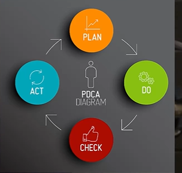

# Quality Management System(QMS)

```txt
First we will understand what quality management system is.
And of course we will understand this in plain and simple language.

And then we will talk about ISO 9001, which is one of the basis for setting up quality management system
in the organization.
```

## What is System?

* What is a System?
  * Set of interrelated or interacting elements

* Organizational Example
  * A company's email system: Servers, software, and
network interact to deliver messages between
employees.

## What is Management System?

* **What is a Management System?**
  * A management system is how an organization
manages the interrelated parts of its business in order
to achieve its objectives

* **Organizational Example**
  * A business's operational plan: A combination of
policies, procedures, and schedules ensures the
company meets its targets efficiently.

```txt
Now management system is sort of a game plan that how we want to win a game, how the coach will plan so that his or her team wins the game.

So here you will have some strategies, some rules which the team has to follow.
That is the management system in simple terms.
```

## What is Quality Management System?

* **What is a Quality Management System (QMS)?**
  * A QMS is a set of interrelated or interacting elements that
organizations use to direct and control how quality
policies are implemented and quality objectives are
achieved.

* **Organizational Example**
  * A manufacturer's QMS: From design to production, every
department follows specific guidelines to ensure the final
product meets customers' expected high-quality
standards.

```txt
And in case of an organization, the QMS will be how we produce the things which we are producing, which our customer want from design to manufacturing, including the purchasing of those items, processing them, manufacturing them, assembling them, dispatching them.

All those things together basically form the quality management system so that our client is happy and

we are able to give good service or good product to our client.
This is quality management system in a simple language.
```

> Now with this introduction, now let us move on to understand about ISO 9001 standard, because that gives us the guideline how to set up a quality management system.


## ISO 9001 : 2015 Introduction

* ISO 9001:2015 is an international standard
that specifies requirements for a Quality
Management System (QMS).
* It helps organizations ensure they consistently
provide products and services that meet
customer and regulatory requirements.
* Think of ISO 9001 as a blueprint for running an
efficient business that customers can trust.

**Take a moment to look at your company's quality manual. Does your company have a quality manual? (It's not mandatory to have)**

```txt
So ISO 9001 was first published in 1987.
That was the first edition.
And then in 1994 there was a second edition of that.
Then it was revised in 2000 and then in 2008, and the latest version at this time is 2015.

And it is expected that in next two years, maybe 25 or 26, 2026, we should be able or we should get the next version of ISO 9001 standard.
But right now the latest standard is ISO 9001 2015.

Now this standard ensures that the company or the organization which is implementing 9001, is producing the product or service on a consistent basis, which meets all the requirements of customer and it meets all the regulatory or the legal requirements.

That is the purpose of 9001.
Basically, it is a blueprint which tells that how a good business should be run.
```

## Understanding ISO 9000, 9001, and 9004

```txt
Now, when we say ISO 9001, there are some other standards as well.
So here are three common standards which are part of ISO 9000 series of standards.
```

* **ISO 9000:** Describes the fundamentals of QMS
and the terminology used, like a **dictionary** for
quality management.
* **ISO 9001:** The requirement standard; if you
want to get certified, this is the standard your
QMS will be judged against.

> Companies are not certified to 9000. Companies are not certified to 9004. They are certified to ISO 9001.

* **ISO 9004:** A guide to achieving sustained
success, providing a broader perspective on
QMS, focusing on continuous performance
improvement.

```txt
The next one, which is 9004, 9004, is think of this as a guide book which tells that how do we implement these 9001 requirements so that our company becomes best in class?

Think of this as a TQM Total Quality Management Guide, or maybe a more comprehensive guide on how to best implement 9001.
But once again, companies are not certified to 9004.

They are certified to ISO 9001.
So this was a brief introduction to ISO 9001.
```

## ISO 9001 : 2015 Part 2 (Clause 1 to 4)

* **Clause 1: Scope** - Details what ISO 9001:2015
covers, essentially the requirements for a QMS and
its ability to consistently provide products and
services that meet customer needs.
* **Clause 2: Normative References** - Contains
references to other documents within the ISO
9000 family that are essential for the
understanding or implementation of ISO 9001.
* **Clause 3: Terms and Definitions** - Provides
definitions for all the terms used in the standard,
ensuring everyone speaks the same quality
language.

```txt
So basically if you look at clause number one, two, three, there is nothing significant which companies need to implement.

Basically this is more of a administrative clauses.

The real clauses or the real instructions come or start from clause number four which is here.
```

## Clause 4: Context of the Organization

* **Understanding the Organization and Its Context** -
Just like knowing the field before playing a game, a
company must understand the internal and
external factors that affect its goals and objectives.
* **Understanding the Needs and Expectations of Interested Parties** - Knowing what customers and other stakeholders expect from the company, just
as a host anticipates the needs of their guests.
* **Determining the Scope of the QMS**-This is about
defining the system's boundaries.

```txt
Now, once again, 9001 helps us in setting up the quality management system.
So now let's think that we have to set up the quality management system.

Standard says that before you do that, think about yourself, yourself as the company, what your company is, what are the factors which are affecting this company?
Who are the stakeholders?

What are the expectations of these stakeholders from the company and determine the scope of quality management system?

What do you want to cover in this quality management system?
What locations, what areas you want to cover in this?
```

```txt
Basically, it's a introspection or thinking about the organization that what this organization is that will help the company to set up a right or the appropriate quality management system.
```

## ISO 9001:2015 Part 3 (Clause 5 to 7)

### Clause 5: Leadership

* **Leadership and Commitment** - Leaders set the tone
for quality, like captains of a ship steering towards
excellence and customer focus.
* **Quality Policy** - This is our promise of quality, a
commitment that guides us in our daily work, like a
compass pointing to our goals.
* **Organizational Roles, Responsibilities, and Authorities** - Everyone knows their role in delivering quality, like players on a sports team each with a position to play.

Please review your company's quality policy. It reflects the
commitment to quality and your role in making it happen.

### Clause 6: Planning

* **Actions to Address Risks and Opportunities** -
Identifying what could go wrong (or right) and
planning accordingly, much like a strategy game.
> Risk based thinking 
* **Quality Objectives and Planning to Achieve Them** -
Setting specific goals for quality and how to reach
them, like a to-do list that guides you toward
success.
* **Planning of Changes** - When we need to change
how we do things, it's planned carefully to keep
the quality high.

Look at the quality objectives related to your work area. They
are designed to meet the needs of your customers.

### Clause 7 : Support

* **Resources** - Ensuring we have what we need.
* **Competence** - Making sure we all have the skills
and knowledge needed to do our jobs well.
* **Awareness** - Keeping everyone informed about the
importance of quality and their role in it.
* **Communication** - Talking about quality within our
team so everyone's on the same page.
* **Documented information** - Documents and records
together form the documented information. This
need to be updated, maintained, made available,
protected, controlled, and retained.



> We are still in planning phase

## ISO 9001:2015 Part 4 (Clause 8)

### Clause 8: Operation

* 8.1 Operational Planning and Control
* 8.2 Requirements for Products and Services
* 8.3 Design and Development of Products and
Services
* 8.4 Control of Externally Provided Processes,
Products, and Services
* 8.5 Production and Service Provision
* 8.6 Release of Products and Services
* 8.7 Control of Nonconforming Outputs

### Clause 8.1: Operation Planning & Control, Clause 8.2: Requirements

* **8.1 Operational Planning and Control**
  * We organize our work to ensure we meet quality standards every step of the way.
  * We use the best tools and processes to deliver products and services that make us proud.
* **8.2 Requirements for Products and Services**
  * We pay close attention to what our customers want and need. We also need to review and
document if we can meet those requirements.

### Clause 8.3: Design and Development of Products & Services

* **8.3 Design and Development of Products and Services**
  * We plan the idea, consider inputs and various controls, and tweak until everything's just right and our final recipe (output) satisfies the client.
  * We ensure that every new product or service is planned, created, and checked to meet our high standards.

### Clause 8.4 & 8.5: Externally Provided Processes, & Service Provision

* **8.4 Control of Externally Provided Processes, Products, and Services**
  * We rely on our partners and suppliers as much as we rely on ourselves. We make sure they're all up
to our standards. (selection, specification, control, information sharing etc.)
* **8.5 Production and Service Provision**
  * Every day, we're like chefs in a kitchen, making sure our work is top-notch, whether we're
cooking up a product or serving up a service. (controlled conditions, identification and
traceability, preservation, post-delivery, changes, release of product)

### Clause 8.6 & 8.7: Release of Products & Services, Control of Nonconforming Outputs

* **8.6 Release of Products and Services**
  * Before any product or service goes out to our customers, we check it like an inspector checks a
house before it's sold. Only the best for our customers!

* **8.7 Control of Nonconforming Outputs**
  * When things don't go as planned, we don't hide them away. We face the issue, fix it, and learn
from it - that's how we get better.

