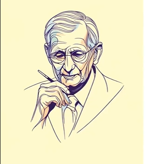
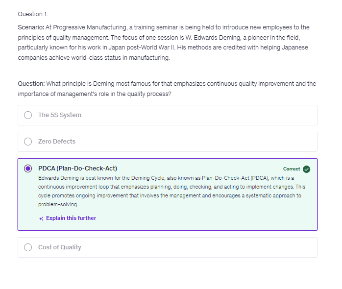
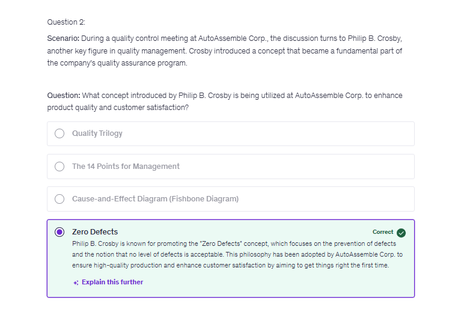
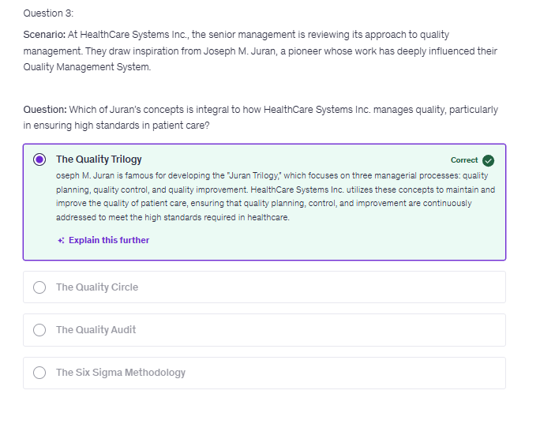
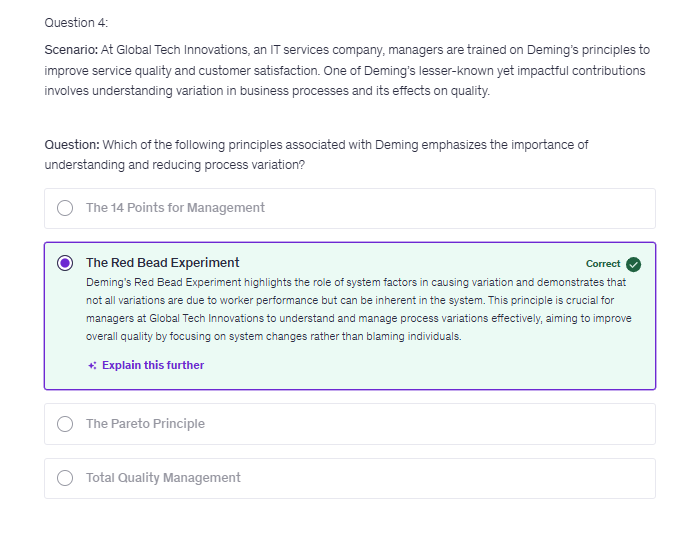
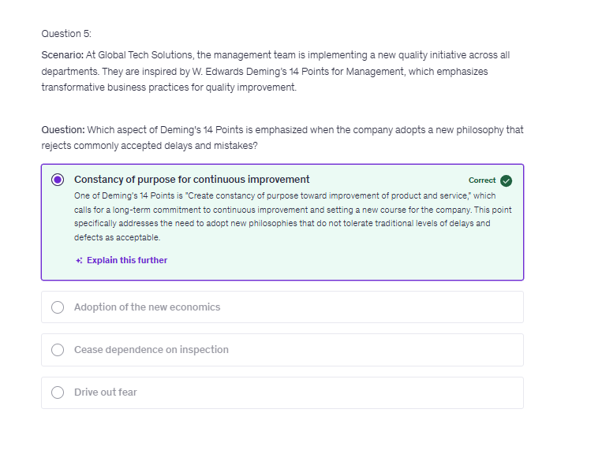
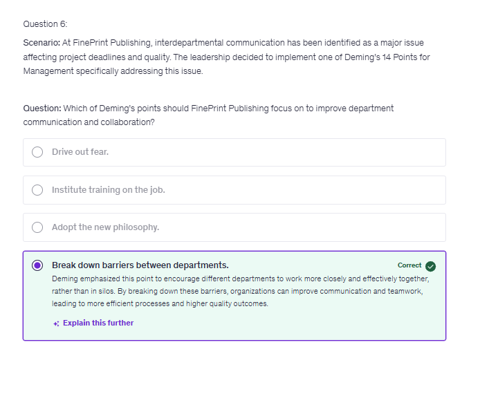

# Quality Gurus

## Quality Gurus - Introduction

## The Role of Quality Gurus in Shaping Quality Thought

* **Overview**: This module explores the
foundational theories and principles
established by key figures in the field of
Quality Management.
* **Purpose**: Understand how these pioneers have
influenced modern quality practices and how
their ideas can be applied to improve our
Quality Management System.
* **Key Figures**: We will explore the contributions
of Edwards Deming, Joseph Juran, Philip
Crosby, and other notable quality gurus.

```txt
And these theories which these quality gurus have proposed, are valid even today in the modern world.
Some of the philosophies which these quality gurus have given go back to, let's say, 1920s, for example,
control charts, which we usually talk today, were first invented or first proposed in 1920s by Walter
Shewhart.

So that thing is still applicable today.
This is still relevant today.
```

## Quality Gurus - Edwards Deming


Link - https://www.qualitygurus.com/w-edwards-deming/

### Edwards Deming's Contributions

* **Overview**: W. Edwards Deming was a pioneering statistician and
quality expert whose ideas reshaped manufacturing processes
around the world, particularly in Japan post-WWII.
* **Key Contributions:**
* **Deming's System of Profound Knowledge: A philosophy that emphasizes the importance of systemic thinking, understanding variation, building knowledge, and understanding human interaction.**
  * **The Red Bead Experiment:** Demonstrates how systems, not people, are the source of most problems in organizational processes.
  * **The Deming Cycle (PDCA):** Plan, Do, Check, Act - a method for continuous improvement.
  * **14 Points for Management:** A comprehensive framework for transforming business effectiveness.
* **Course Focus: In this module, we will concentrate specifically on Deming's 14 Points for Management, exploring two points in detail on each following slide.**


```test
So this was one contribution of Deming.
Another one is PDCA cycle.

The actual credit of PDCA cycle goes to Walter Shewhart, but then Deming promoted that, and later
on Deming changed the PDCA cycle, which is plan, do, check and act cycle to PDSA, which is plan,
do, and study act instead of check.
He replaced that with study because checking is more of a inspection.

Study is actually looking at the system and finding out that
what is the reason of this variation?
```

## Deming's 14 Principles of Management (Part 1)

### Deming's 14 Points for Management - # 1 & 2

* **Point 1: Create constancy of purpose toward improvement of product and service**
  * Organizations should focus on long-term planning, with the intent of continuously innovating and improving products and services rather than only reacting to short-term financial pressures or market demands.
  * Question: "Think about your department. What long-term improvements could be initiated, and how could these shifts help us stay competitive and relevant?"

* **Point 2: Adopt the new philosophy**
  * In the modern business environment, companies must adopt a new mindset that embraces change and rejects the status quo if it's ineffective. This involves a commitment from top management to ensure quality and operational excellence.
  * Question: "Reflect on your current work processes. What 'old philosophies' might you challenge to improve your operations or customer satisfaction?"

* **Point 3:** **Cease dependence on inspection to achieve quality**
  * Quality should be built into the product from the start rather than relying on inspections at the end of the production line to find flaws. This point advocates for improving the process and thus reducing the need for detailed inspections.
  * Question: "How reliant is our team on inspection to catch mistakes, and what changes could we make to improve quality from the outset?"
  * > So here the question for you is think about your area where you mostly depend on inspection to catch the problem at the end and think that what else you could do so that your process is much more stable, your process is much more capable so that there is less and less need of inspection.

* **Point 4:** **End the practice of awarding business on the basis of price tag alone**
  * Businesses should not select suppliers based solely on price but
consider other factors like quality, service, and reliability. Establishing
long-term relationships with suppliers ensures consistent material
quality and encourages mutual growth and loyalty.
  * Question: "Can you think of an instance where choosing a supplier
based on cost over quality backfired? What was the lesson learned?"

> Deming even encourages company to go for a single supplier so that you have a long term relationship with your supplier. The success of you and the success of your supplier is tied together. That way you will have a much better quality in your product because you depend on each other.

```txt
Now, a simple example of that would be a restaurant chain which works with the farmers and have a close
relationship with them, so that the restaurant gets the fresh vegetable every time, rather than just
buying those vegetables based on the price based on the lowest price.
Instead of that, the restaurant would prefer to partner with farmers so that the fresh vegetables are
provided.
```

## Deming's 14 Principles of Management (Part 2)

### Deming's 14 Points for Management - # 5 & 6

* **Point 5: Improve constantly and forever the system of production and service**
  * **Continuous improvement should be a permanent objective in every aspect of work**, from production to service delivery. This involves constantly seeking ways to reduce waste, improve efficiency, and increase productivity.
  * **Question**: "What is one process in your area that could benefit from continuous improvement, and what specific change would you suggest?"

```txt
Now an example of this would be a health care company, which has implemented a feedback system to get
the feedback from patients, the feedback from the staff, nurses, doctors so that they can continuously
or continually improve the processes to provide better service to their patients or the clients.

Now, the question for you would be think about a process in whatever you do.
Is there any need to keep on continuously improving that process?
And I'm sure their answer would be yes.
Whatever you are doing, there is always a chance of or the possibility of improving that process.
So think about that process and think that what specific action could be taken right now to improve
that process.
```

* **Point 6:** **Institute training on the job**
  * Employees should receive training not just at the start of their
jobs but continually, as they work. This ensures they are always
equipped with the latest skills and knowledge directly applicable
to their roles.
  * Question: "How does ongoing training impact your ability to perform your job, and what additional training would help you improve?"

```txt
Now here the example would be a software company which keeps on training their coders or the software
professionals on the latest development in the software, because in software industry, the professionals
who are doing coding, they continually need to upgrade their knowledge and company is helping them
in upgrading that knowledge.
```

### Deming's 14 Points for Management - # 7 & 8

* **Point 7: Institute leadership**
  * **Leadership should aim to help people do a better job rather than merely supervising them**. Effective leaders work with their teams to achieve high quality and productivity, removing barriers that prevent them from doing their best work.
  * > Now here the example of that would be a retail manager works with their employees during the peak hours, so that this manager also gets a good understanding of the customer needs or the difficulties, what the staff is actually facing, or is there any resource which need to be provided to these people? That is the leadership.
  * Question: "Can you think of a time when effective leadership helped you improve your work? What qualities did that leader exhibit?"

* **Point 8: Drive out fear**
  * Employees should feel secure enough to express ideas or
concerns without fear of repercussion. An environment without
fear promotes open communication and innovation, which are
critical for quality improvement and problem-solving.
  * Question: "Have you ever held back from offering feedback or a
suggestion because of fear? What changes in the work
environment might encourage more open communication?"

```txt
This is an important point.
Think about a scenario where people are afraid to tell something to their manager, what type of quality
improvement this company would have.

People won't tell anything to their manager because they might fear that if we tell them, we might
get punished for that. Instead of that think of a scenario where there is a open environment of communication. 

People can freely talk to their manager.

If there is any challenge, if there is any issue, people can comfortably talk to the management and
that issue gets resolved.
That is the type of scenario where there would be quality improvement, process improvement when people
do not have fear, when people have a open communication channel.
So what Deming is suggesting.
That companies should drive out fear so that people can freely, openly communicate.
```

## Deming's 14 Principles of Management (Part 3)

### Deming's 14 Points for Management - # 9 & 10

* **Point 9: Break down barriers between departments**
  * Encourages the elimination of competition and silos between departments to promote teamwork and a more holistic approach to achieving the organization's goals. Departments should work collaboratively, sharing information freely to improve efficiency and quality.
  * Question: "Have you experienced barriers between departments in your work? What effect did this have, and how could these barriers be removed?"

* **Point 10: Eliminate slogans, exhortations, and targets for the workforce**
  * Deming believed that asking for higher productivity without providing the methods to achieve it only leads to frustration. Slogans and generic exhortations that do not empower actual improvements are not effective.
  * Question: "Think about motivational tactics that have been used in your workplace. Do they genuinely help you improve, or do they feel superficial?"

```txt
So let's say if you are able to make 1000 pieces, then next day the management will say that now our
target is 1200 pieces.

But you can't put these targets on random basis.
These targets need to be on the basis of the system what you have.

Another thing here is eliminate slogan like putting a big board everywhere in the company that we are
best or quality is our first priority does not mean anything.

The first thing that it tells is that management thinks that quality is the problem by the workers,
so that's not the case.

Quality is achieved through the system.
You cannot blame workers or people who are doing the job for bad quality.
You need to have established the system to achieve quality.
So just by putting random slogans or random targets, you cannot achieve quality.
```

```txt
Question - Did you see a poster or did you see a motivational quote in your company, which is asking you to improve the quality rather than providing the required resources and did that achieve the objective?
Did by looking at the poster which says the quality is our first priority.

Did you see quality improving in the company instead of that, what effect you would have seen if the
required training was given to the people?
Good tools were given to the people, would that have achieved the quality instead of posters and targets?
Think about that.
```

### Deming's 14 Points for Management - # 11 & 12

* **Point 11: Eliminate numerical quotas for the workforce**
  * Deming argued that quotas focus on quantities rather than
quality or methods. They can lead to poor workmanship as
employees rush to meet targets. Instead, the focus should be on
improving the process and quality of the output.
  * Question: "Have you worked under numerical quotas? How did
it affect your work quality and job satisfaction?"
  * > Now, the question here for you would be, have you worked in an area where you had to struggle to meet the numbers and to meet those numbers? Probably sometime you might have compromised quality as well? Think about that.

```txt
And here the example of that would be a call center, which earlier used to have some quota that we
need to attend so many calls instead of that.
Now their quota is on the satisfaction level of the customers that whatever problems we are solving,
that problem should be resolved fully.
```

* **Point 12: Remove barriers that rob people of pride in their work**
  * This point stresses the importance of allowing employees to
take pride in their work without being hindered by inefficient
systems or restrictive policies. Happy, engaged employees are
more likely to produce high-quality work.
  * Question: "Can you identify any barriers in your workplace that
prevent you from taking pride in your work? What are they, and
how could they be addressed?"

```txt
And here the example would be a manufacturing company who has changed the method of annual evaluation
where rather than looking at the numbers, how many items you have produced, how many customer queries

you have solved, rather than that they are looking at how innovative you were, how good you were in
achieving the quality.

In addition to that, this company also worked on removing all the barriers which prevented you from
doing good job. And this would mean giving a training to you, or providing the right tool or the systems to do your job. Once again, people want to do good job. They want to be proud of their work. Companies should help them in doing that job
```

```txt
well, now the question here for you would be, think about a scenario where something as a part of
system, something as a part of lack of knowledge, lack of training has stopped you from doing a good
job. What was that?

If you find out, raise that to your management, to your supervisor, that this is something which
is stopping me from doing my job well,
```

### Deming's 14 Points for Management - # 13 & 14

* **Point 13: Encourage education and self-improvement for everyone**
  * Continuous learning and development are crucial for personal
growth and organizational success. Deming emphasized the need for
ongoing education and training across all levels of an organization to
keep skills updated and minds sharp.
  * Question: "What opportunities for education or self-improvement
have you taken advantage of in your career? How could further
training improve your work?"
  * > And an example of that would be a company which allows their employees to do online courses so that they can learn something new, so that they can implement that new thing into their job, or they could advance in their profession.
  * > So just like every other point, here the question for you would be what opportunity, education or self-improvement have you taken recently? Does your company allow that? And I would say that even if you do not have a system of that in your company as a person, you shouldalways be thinking of improving your knowledge, improving your skills so that you can advance in your career.

* **Point 14: Take action to accomplish the transformation**
  * Transformation is not automatic. It requires a structured plan, commitment from all levels of the organization, and active participation. Deming highlighted the importance of action in making meaningful changes to improve quality and operational effectiveness.
  * Question: "Reflect on a significant change at your workplace. Were you involved in the process? What would you suggest to ensure such transformations are successful in the future?"

```txt
Don't just read those points and do nothing.
So basically point number 14 says do something about whatever you have learned in previous 13 points.
```

## Quality Guru - Joseph Juran



### Joseph Juran and the Quality Trilogy

* **Overview:** Joseph Juran was a legendary figure in the field of quality management whose work has been instrumental in shaping our approach to quality in business operations.

* **Key Contributions:**
  * Juran's Quality Handbook: First published in 1951, this seminal work provided
a foundation for quality management practices globally.
  * The Quality Trilogy: A comprehensive approach emphasizing three managerial
processes: quality planning, quality control, and quality improvement.
  * **Pareto Principle in Quality:** Juran's adaptation of the Pareto Principle,
suggesting that a small number of causes are responsible for a large portion of
problems, focusing efforts on the 'vital few.'
  * > Pareto principle is 80-20 principle. So basically in the field of quality it means that 80% of the problems are because of 20% causes. So if you have to focus on something you focus on those 20% causes which are creating 80% of the problem. So basically this helps in prioritizing where you need to take action.
  * **Juran's Ten Steps to Quality Improvement:** A systematic guide for organizations
seeking to improve their quality processes and outcomes.

* **Course Focus:** In this section, we'll explore Juran's Quality Trilogy
in-depth, applying each component to real-world organizational
challenges and discussing how we can integrate these principles
into our daily work.

## Juran's Quality Trilogy

```txt
Now quality trilogy, you could think of three components of quality management which are interrelated, and these components are Quality Planning, Quality Control and Quality Improvement.
So basically these three components form the foundation of quality management system and helps companies to deliver good product or service to their clients.

And each part of Quality trilogy, which is quality planning, quality control and quality improvement, feeds upon each other.
So after quality planning, you go to quality control and then you go to quality improvement and the cycle continues.
And this is a never ending cycle of improvement.
```

* Concept Overview: Juran's Quality Trilogy
conceptualizes quality management as three
interrelated processes: quality planning, quality
control, and quality improvement.
* Foundation of Excellence: The trilogy forms the
bedrock of a robust quality management system,
guiding organizations in delivering products and
services that satisfy customer needs.
* Continuous Process: Each part of the trilogy feeds
into the next, creating a cycle of never-ending
improvement where planning leads to control and
control leads to analysis and further improvement.

### 1. Quality Planning

* Definition: The process of identifying customers,
determining their needs, and developing the
products and processes necessary to meet these
needs.
* Explanation: Quality planning involves setting
goals, identifying customers, discovering customer
needs, developing product features, and
establishing process controls that can deliver those
features.
* Question: "How can you participate in quality
planning in your area to better meet customer
expectations?".

> Now here the question for you would be think that do you play a role in quality planning in whatever product or service your company is providing? For example, looking at the features, looking at the customer needs, looking at how these features are expected to meet the customer needs. Do you have any role to play in that? Think about that maybe. You might not have that role directly, but indirectly you might be influencing that.

### Quality Control

* Definition: The process of meeting product
and service goals during operations.
* Explanation: Quality control is about
monitoring process performance, comparing
actual performance with goals, and taking
action on the difference.
* Question: "What quality control measures do
you use in your daily work to ensure that your
outputs meet the required standards?"
  * > Now the question for you would be, do you have anything to do with quality control? Does your role involve anything related to quality control, where you check the product or service which you want to deliver to the customer, and make sure that this meets the requirement? And I'm sure that whatever role you are in, there will be some component of quality control you would be doing related to that product or service which is being delivered to the customers.


### Quality Improvement

* **Definition**: The process of creating breakthroughs
required to improve performance to
unprecedented levels.
* **Explanation**: Quality improvement involves
breaking down existing patterns and systems,
making changes that lead to superior
performance. It's about continuous improvement
and often requires innovative thinking.
  * > So when you are doing quality improvement, do this as a part of group or as a part of cross-functional team.
* **Question**: "Can you identify a recent change in
your department that was part of a quality
improvement initiative? How did it affect your
work?"
  * > Now here the question for you would be have you been involved in any quality improvement process? Or maybe if not, have you seen any quality improvement effort ongoing in your organization that will make your product or service better than what it is today?

```txt
So this was Quality Trilogy proposed by Doctor Juran, which consists of Quality Planning, Quality Control and Quality Improvement.
And these things keep on circling.
So you do quality planning and you do quality control.
And based on that you make some improvements.
And again, you plan, control and improve.
And this is an ongoing circle.
So this is a brief description of work done by Doctor Joseph Juran.
```

## Quality Guru - Philip Crosby

### Introduction to Philip Crosby

Book - Quality is free

* Philip Crosby was a trailblazer in quality management,
advocating a proactive approach that aimed to instill a
zero-defects culture within organizations.
* **Key Contributions:**
  * **Zero Defects Concept:** Advocated for flawless production, promoting
the idea that organizations should aim for no defects in their output.
  * **Crosby's 14 Steps to Quality Improvement:** Outlined a sequence of
steps for organizations to cultivate and sustain a focus on quality.
  * **The Four Absolutes of Quality:** Defined quality as conformance to
requirements, prevention as the main mechanism, zero defects as
the performance standard, and the measure of quality as the price
of non-conformance.
* Course Focus: In this module, we will concentrate on
Crosby's Four Absolutes of Quality, dissecting each one to
understand how they can redefine our approach to quality
management.

### Philip Crosby 4 Absolutes of Quality

### Absolute #1

* **Absolute #1 - Quality is Conformance to Requirements**
* The standard of quality is measured by the degree
to which the product or service adheres to the
defined requirements.
* **Explanation:** Just like a key must fit a lock perfectly
to work, the product or service must meet specific
criteria to satisfy the customer's needs.
* Reflection: "How do you ensure that your work
conforms to the requirements set out for it?"

> And now here is a question for you to look into. Whatever work you are doing. Do you have requirements? Do you have specification which you need to conform to if you are meeting those requirements, if you are conforming to those specification, that means you are doing a quality job.


### Absolute #2

* **Absolute #2 - The System of Quality is Prevention**
* Quality should be about preventing mistakes from
happening rather than inspecting and fixing them
after they occur.
  * > Quality has to be achieved by systems and processes, by preventing wrong things from happening. That's how you achieve quality, rather than checking the product, finding the problem and correcting that. So that's not the good way to do that. Good way is preventing the problem from happening in the first place.
* Explanation: It's more efficient to avoid errors in
the first place, like double-checking your shopping
list before leaving home, so you don't forget
anything.
* Reflection: "What steps can you take in your role
to prevent errors before they happen?"

```txt
Whatever job you are doing, there is a possibility that you would be making a mistake sometime.
The product would not be good.
So in that case you would need to do some repair.

But what are the actions you can take to avoid that problem from happening in the first place?
What preventive measures you could take?

Maybe you could have a checklist which you want to use before you release that product to the next step
that I have performed all these ten steps.

Or maybe you need a training or maybe some other tool which you need to make sure that the product or
the action you are doing is defect free.
```

### Absolute #3

* **Absolute #3 - The Performance Standard is Zero Defects**
* The only acceptable standard is one where there
are no defects in the process or product.
* Explanation: In manufacturing, error-proofing
techniques (poka-yoke) are implemented to
prevent mistakes before they happen. For
instance, a car assembly line might use sensors to
ensure that components are correctly positioned
before they are secured.
* Reflection: "In what ways can aiming for zero
defects improve the way you approach your
tasks?"
  * > And now, once again, question for you. Whatever work you are doing, whether you are making a product or you are delivering a service, what you could do to make it a zero defect product, think about that. Think about where problems happen and how those problems could be avoided. That will make your product or service a zero defect product or service.

### Absolute #4

* **Absolute #4 - The Measurement of Quality is the Price of Nonconformance**
* The costs associated with not meeting quality
standards, such as rework, returns, or lost
business, are the true measure of quality.
  * > So the cost of quality consists of four components which are the prevention cost, the appraisal cost, internal failure cost and external failure cost. And we understand that the worst component of this is the external failure cost. When the product fails in the hands of client, that is the worst thing which could happen, which will lose the reputation of the company, which might harm the client, which would reduce the market share of the company.
* **Explanation**: Car recalls not only involve the direct costs of fixing the issue but also the indirect costs of tarnished brand reputation and lost future sales,
showcasing how nonconformance can have far- reaching financial implications.
* **Reflection**: "What are some of the costs associated with nonconformance that you've encountered, and how can these be reduced?"
  * > And just like what we have been doing earlier, here is a question for you to think over whatever job you are doing. If there is any non-conformity, what is the cost associated with that, cost associated with finding out the problem? Cost related to the repairing or taking action on that problem? Think about that. That how much does it cost related to if there is any nonconformity in the work which you are doing, have a thought on this.

## 6 more Quality Gurus

### Kaoru Ishikawa

* Known for developing the Cause and Effect Diagram (also known
as the "Ishikawa" or "fishbone" diagram), which is used to trace
the root causes of a particular event.
* Pioneered the concept of **quality circles**, a group of workers who
perform the same or similar work, who meet regularly to
identify, analyze, and solve work-related problems.

### Genichi Taguchi

* Developed the Taguchi methods for **robust design and quality
engineering**. His approach to quality emphasizes the
minimization of variation and the reduction of costs for
manufacturing and customer phases.
* Introduced the idea that societal loss occurs from the time a
product is shipped (Loss Function), emphasizing the importance
of robust design to minimize variability and reduce quality loss.

### Armand V. Feigenbaum

* **Introduced the concept of Total Quality Control**, which is
considered the precursor to Total Quality Management
(TQM). His approach emphasized that quality control
should be integrated into all aspects of an organization.
* He also illuminated the **concept** of the **"hidden factory"**-
the idea that in every organization, there is a portion of
the enterprise that operates in the shadows, producing
nothing but waste due to poor quality.

### Shigeo Shingo

* Known for his work with Toyota that led to the creation of
the Toyota Production System and Just In Time (JIT).
* Poka-Yoke: Developed the error-proofing approach
known as Poka-Yoke, which helps prevent mistakes in the
manufacturing process before they occur.

### Walter A. Shewhart

* Often referred to as the father of **statistical quality control**,
developed the **control chart method** to monitor process
variability.
* Credited with developing the **Plan-Do-Check-Act** cycle to ensure continuous improvement, a concept later popularized by Deming.

### . Taiichi Ohno

* **Toyota Production System (TPS):** Ohno's contributions to the TPS
laid the groundwork for lean manufacturing, emphasizing
efficiency and the elimination of waste.
* **Just-in-Time & Kanban:** He devised the just-in-time approach to
production to meet demand precisely with what's needed and
when it's needed, supported by the kanban system to visually
manage workflow and inventory.

## Quiz











