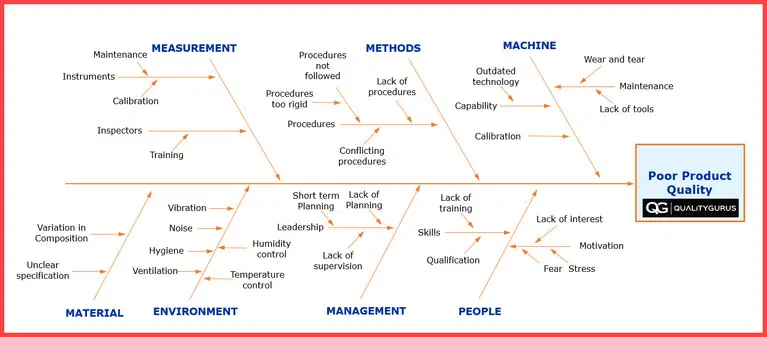
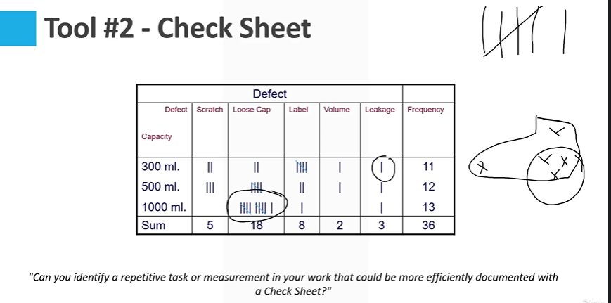
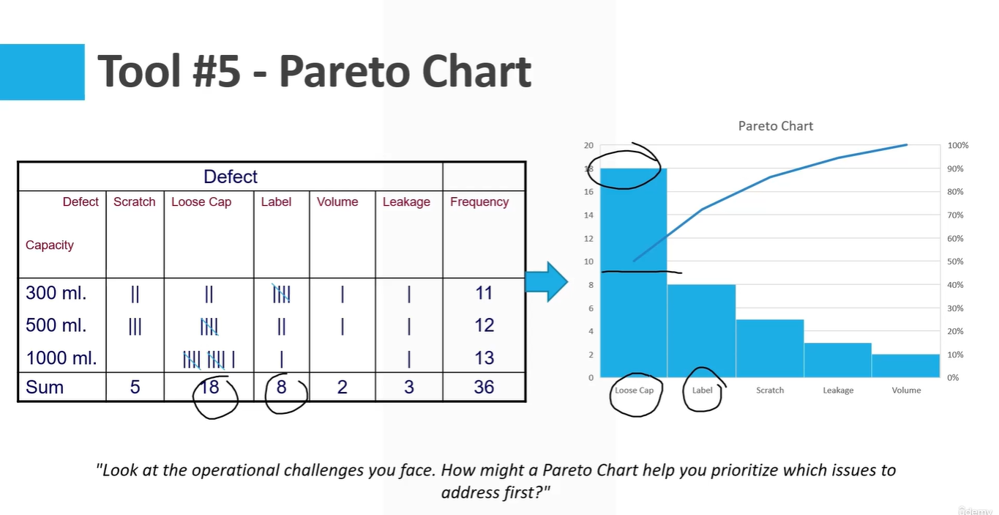
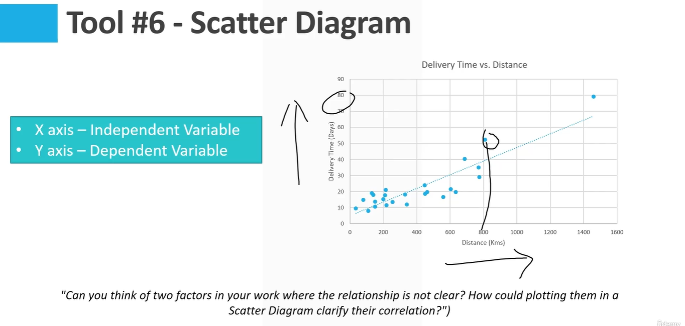

# Quality Tools & Techniques

* **Purpose of Module:** Module 4 provides an
overview of essential tools and techniques for
quality improvement within any organization.
* **Learning Outcomes:**
  * Understand the functions and applications of the Seven Basic Quality Tools.
  * Learn how Lean and Six Sigma can drive process excellence.
* **Applicability:** These versatile tools and
methodologies can be applied across various
industries and departments to enhance quality
and operational performance.

## The Seven Basic Quality Tools - History and Philosophy

Link - https://www.qualitygurus.com/seven-basic-quality-tools/

* **Historical Roots:** The Seven Basic Quality Tools were
conceptualized by Kaoru Ishikawa, a renowned Japanese
organizational theorist, in the midst of Japan's post-war industrial
revolution.
* **Inspiration from Tradition:** Ishikawa's inspiration for the tools
came from the legendary **seven weapons of Benkei**, a famous
Japanese warrior monk, symbolizing the idea that a well-
equipped individual can tackle any challenge.
* **Underlying Philosophy:** Ishikawa believed that these tools could
effectively address the majority of a company's problems. He
famously stated, "More than 95% of the problems in a company
can be solved by the 7 QC Tools."
* **Impact on Quality Control:** These tools have been widely adopted
and are considered foundational in the field of quality control,
reflecting a simple yet powerful approach to problem-solving and
process improvement.

```txt
And the quality guru who conceptualized this, which is Ishikawa, he believed that 95% of the problems could be solved by just using these basic seven quality tools. You do not need advanced tools most of the times.

A majority of the problems could be solved just by these seven basic quality tools.

These are easy to understand at any level in the organization, and anyone in the organization can use these seven basic quality tools to solve the problems which they are facing.
And these seven basic quality tools have been widely accepted in the field of quality.
```

Here are the Seven Basic Quality Tools as listed by
the American Society for Quality (ASQ), each a
fundamental instrument for quality control and
improvement:

* Cause and Effect Diagram
* Check Sheet
* Control Chart
* Histogram
* Pareto Chart
  * > We have a Pareto chart, which is based on 80- 20 principle that 20% of the causes create 80% of the problem.
* Scatter Diagram
* Stratification

## Tools #1 - Cause and Effect Diagram

Link - https://www.qualitygurus.com/cause-and-effect-diagram-fishbone-or-ishikawa-diagram/

* Purpose: The Cause-and-Effect Diagram, also
known as the Ishikawa or fishbone diagram,
systematically lists all the different causes that can
contribute to a specific problem or effect.
* How It Works: It categorizes potential causes of
problems to identify their root sources and
displays them in a layout resembling a fish's
skeleton.
* Creating the Diagram: Start with the problem
statement (effect), draw a straight line from it (the
fish's spine), and branch outlines for potential
cause categories (the fish's bones).

```example
Now an example would be let's say you have a problem where there is a product delivery issue.
Your product delivery is late.

So if that is the problem, then you might want to list down all the causes which could have led to
or which could lead to that particular problem of the delivery delays.
```



```txt
You do not need a high tech or high technological tool for this.

Just use the whiteboard or just use a bigger size of paper and do this as a group.
And once you have done that, and if you want to make a report or something, in that case you might want to make a cleaner copy in, let's say, Excel or Word or PowerPoint.
But the basic use of tool is just using pen and paper or maybe on a whiteboard.

And then once you have listed down all the causes, then what you do is you evaluate them and see that what could have been the real cause or what is the most important cause out of these.
```

> Just do a brainstorming. Any idea, any thought is welcome. And then you put that on the fishbone diagram, because here you are looking at thepotential causes.And then once you have listed down potential causes, then you can do the evaluation or you can discuss that that which could be the most important cause of the problem.

## Tool #2 - Check Sheet

```txt
Check-Sheet is a data collection tool.
So wherever you need to collect some data that's where you use a checksheet.

So it is a structured way of collecting data.
In today's world this might not be really too much relevant, but still you can find a good use of checksheet in different scenarios.
```

* Purpose: A Check Sheet is a structured, prepared
form for collecting and analyzing data. It's a simple
yet effective way to gather data in real time at the
location where the data is generated.

* How It Works: This tool enables a user to easily
record and compile data from observations or
inspections, which can be quantitative or
qualitative.

* Designing a Check Sheet: Determine what data will
be collected and design the sheet to make
recording easy and reduce the chance of errors.



> But generally in today's world there are modern methods of data collection. But this is something which is cheap, simple and easy to use in any type of scenario.

## Tool #3 - Control Charts

Link - https://www.qualitygurus.com/seven-quality-tools-control-charts/

* **Purpose**: Control Charts study how a process
changes over time. They are powerful tools for
monitoring process stability.
* **How It Works:** By plotting the values of a process
variable over time, you can see patterns, such as
trends or cycles, that may suggest problems within
the process.
* **Key Elements:** The chart consists of points
representing a statistic (e.g., mean, range,
proportion) of measurements of a quality
characteristic in samples taken from the process at
different times.

```txt
This one is, I would say that the most complex tool out of these seven basic quality tools, because in addition to plotting the values, which I will show you on the next slide, you need to calculate the upper and lower control limits.
There are mathematical formulas for that.
```

## Tool #4 - Histogram

Link - https://www.qualitygurus.com/seven-quality-tools-histogram/

* **Purpose**: Histograms display the distribution of
process data and help you understand the
variation within a process.
* **How It Works:** This bar chart shows how
frequently each different value in a set of data
occurs. It's particularly useful for
demonstrating the shape and spread of the
process data.
* **Creating a Histogram:** Collect continuous data,
decide the number of intervals, and count
how many data points fall into each interval.

## Tool #5 - Pareto Chart

Link - https://www.qualitygurus.com/seven-quality-tools-pareto-chart/

* **Purpose**: The Pareto Chart is a graphical tool that
prioritizes the causes of problems in a process by
the frequency of their occurrence. It helps focus
on the most significant issues.
* **How It Works:** Combining a bar and line graph,
individual values are represented in descending
order by bars, and the cumulative total is
represented by the line.
* **Building the Chart:** Identify and categorize issues,
count how often each occurs, then order them
from most to least frequent to understand which
categories have the biggest impact.

```txt
Now Pareto chart is based on the principle of Pareto, which is 80 - 20
principle.
That means 80% of the problems are caused by 20% of the issues, and that will help us in focus our attention to very specific thing.

By doing the smallest amount of work, we want to get the maximum benefit, and that is where the Pareto chart helps us in.
```



## Tools #6: Scatter Diagram

Link - https://www.qualitygurus.com/seven-quality-tools-scatter-diagram/

* Purpose: The Scatter Diagram, or Scatter Plot,
helps identify the potential relationship
between two variables.
* How It Works: It's a type of plot or
mathematical diagram that uses X/Y
coordinates to display values for two variables,
typically for a data set.
* Creating the Diagram: Plot pairs of numerical
data, one variable on each axis, to look for a
pattern or correlation between the two
variables.

