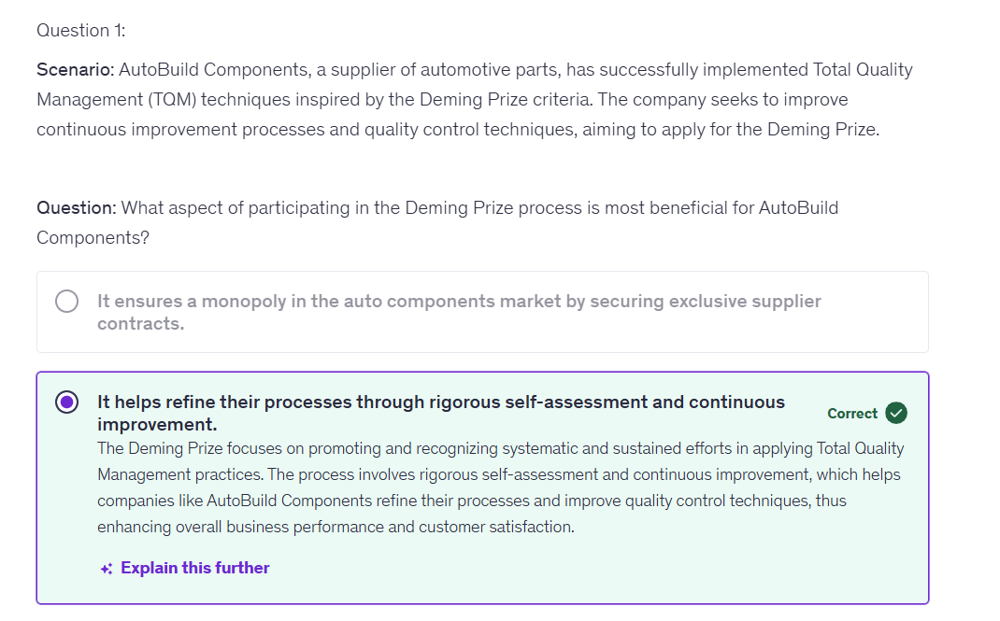

# Measuring Success

Link - https://www.qualitygurus.com/cost-of-quality/

* Purpose of the Module: This final module focuses on
understanding and applying concepts critical to measuring
the effectiveness of quality initiatives within an
organization.

* Learning Outcomes:
  * Understanding the Cost of Quality: Learn to distinguish between the
costs of conformance (doing things right) and the costs of non-
conformance (corrections needed when things go wrong).
  * Measuring Quality Performance: Explore key metrics and indicators
that are used to gauge the quality performance of processes and
products.
  * The Role of Quality Awards and Recognitions: Understand how
external validations like quality awards and recognitions can
motivate organizations to maintain and elevate their quality
standards.

* Applicability: By the end of this module, you'll be able to
utilize these metrics and understandings to measure and
enhance your organization's overall quality performance.

## Visible vs Invisible Cost of Poor Quality

* Purpose of Segment: Explore the concept of the
Cost of Quality, an essential metric for evaluating
the total cost of quality-related efforts and
deficiencies.
* Overview: Understanding the Cost of Quality helps
organizations identify the amount of resources
utilized to prevent poor quality and the
consequences of not meeting quality expectations.
* Objective: Equip participants with knowledge to
analyze, track, and optimize expenditures related
to quality, both in preventing defects and
addressing them when they occur.

### Visible vs. Invisible Costs of Quality

* **Visible Costs:** Easily identified and directly
attributed to quality, such as scrap, rework,
and returns.
* **Invisible Costs:** These are less apparent and
include things like lost opportunities, lost time
due to inefficiencies, and reduced customer
satisfaction.
* **Impact on Business:** Both visible and invisible
costs can significantly affect the bottom line,
but invisible costs can be more damaging in
the long run.

## Classification - Cost of Conformance and Non-conformance

### Four Categories of Quality Costs

* **Purpose of Discussion:** To understand the different
categories of costs associated with maintaining and
improving quality.
* **The Four Categories:** Quality costs are traditionally
categorized into four groups. Each category distinctly
impacts an organization's financial health and
operational efficiency
  * Prevention Costs
  * Appraisal Costs
  * Internal Failure Costs
  * External Failure Costs
* **Strategic importance:** Understanding these costs helps
organizations allocate resources effectively, enhance
product quality, improve customer satisfaction, and
maintain better control over their production and
service processes.


### Prevention Costs

* Definition: Costs incurred to prevent the occurrence of
non-conformances in the future, essentially costs of
activities specifically designed to prevent poor quality in
products or services.
* Examples:
  * Training programs for employees.
  * Implementation of quality planning and control procedures. Investment in better equipment and technology.
* Benefits: Reducing the likelihood of defects and errors before they happen, leading to lower overall quality costs.

"How much does our department invest in preventive measures?
Could increasing this investment reduce costs in the long term?"

### Appraisal Costs

* **Definition:** Costs associated with measuring and
monitoring activities to ensure quality standards
and performance.
* **Examples:**
  * Testing of raw materials or finished products.
  * Inspections to ensure conformance to standards.
  * Costs of certification processes.
* **Rationale:** Ensures that the end products meet the
quality standards and that the manufacturing
processes are performed correctly.

"Is there an area in your work where increasing appraisal
activities could help catch problems earlier?"

## Internal Failure Costs

* Definition: Costs that occur before a product is
shipped or a service is delivered as a result of
non-conformance to requirements.

* Examples:
  * Rework or corrections.
  * Scrap materials.
  * Downtime caused by quality problems.

* Impact: Directly affects production efficiency
and increases operational costs.

"Can you think of a recent project that encountered internal failures?
What were the costs associated with resolving these issues?"

### External Failure Costs

* Definition: Costs that occur after the product is
shipped or the service is delivered as a result of
non-conformance to requirements.

* Examples:
  * Warranty claims and replacements.
  * Handling complaints and returns.
  * Lost sales and reputation damage due to customer
dissatisfaction.

* Consequences: Often the most expensive as they
impact customer satisfaction and future business.

"Recall an external failure your department has experienced.
What were the long-term consequences on customer relations
and costs?"

## Measure the Cost of Quality

* Purpose: Measuring these costs helps pinpoint
areas where quality-related expenses can be
reduced while improving the product or
service.

* Benefits:
  * Identifies opportunities for improvement.
  * Justifies investments in quality initiatives.
  * Enhances customer satisfaction and loyalty.

"Consider the potential benefits of measuring and reporting the
Cost of Quality in your area. How might this influence decisions?"


## Quality Performace Indicators and Matrics

* **Purpose**: This segment focuses on the metrics and
indicators critical for measuring the success of
quality initiatives across an organization's various
aspects.

* **Key Takeaways:**
  * Learn about various metrics that are commonly used to
assess quality performance.
  * Understand how to apply these metrics to monitor and
improve quality processes continuously.

* **Application:** By the end of this segment,
participants will be able to implement these
metrics in their daily operations to track
performance and identify areas for improvement.

* **Customer Satisfaction Scores:** Measures how
products or services meet or surpass customer
expectations.
* **Defect Rates:** The percentage of products or
processes that are flawed and require rework.
* **First Pass Yield (FPY):** The percentage of items
produced correctly and without rework the first
time through the process.
* **Return Rates:** This tracks the rate at which
customers return products, highlighting potential
issues with product quality or customer
satisfaction.
* **On-Time Delivery Rate:** Measures the percentage of
products or services delivered to customers within the
promised time frame, reflecting the efficiency of the
production and delivery process.
* **Warranty Claim Rate:** The frequency with which
customers request service under warranty, providing
insight into the long-term quality of products after
purchase.
* **Corrective Actions Effectiveness:** Tracks how effective
corrective actions are in addressing and preventing non-
conformity recurrence.
* **Employee Engagement in Quality:** Measures the level of
employees' involvement and commitment to quality
initiatives.


"Which metric could provide meaningful insights into your area's
performance? How might you gather and analyze this data?"

### Advanced Quality Metrics

* **Cost of Quality (CoQ):** This measure tracks the total
costs associated with preventing, appraising and
internal/external failure costs in products or services.
* **Process Capability Index (Cpk):** Statistical measurement
of a process's ability to produce output within
customer-defined specification limits.
* **Supplier Quality Ratings:** This component of supply
chain management evaluates the quality of suppliers'
processes and outputs.
* **Product Reliability:** The probability that a product will
perform without failure over a specified period or usage
cycle, typically reflected in mean time between failures
(MTBF).

### Utilizing Quality Metrics Effectively

* **Integration with Business Goals:** Ensure quality
metrics align with broader business objectives to
reinforce their relevance and importance.
* **Continuous Improvement:** Use metrics not just for
control but as a basis for continuous improvement.
Regularly review and adjust metrics to keep them
relevant as business conditions change.
* **Benchmarking:** Compare performance against
industry standards or competitors to gauge where
your organization stands and where improvements
can be made.

**"Identify one quality metric that your team could better utilize. Plan a small project to enhance this metric's monitoring and reporting."**

## Three Quality/ Business Excellence Awards

* Purpose of Quality Awards: Quality awards and
recognitions serve as a benchmark for excellence and a
means to honour organizations that achieve high standards
in their quality practices.
* Driving Factors for Excellence: These awards recognize
achievement and encourage companies to analyze their
processes critically, strive for continuous improvement,
and promoto indust, best practices
* Examples of Awards:
  * Malcolm Baldrige National Quality Award in the USA.
  * Deming Prize in Japan.
  * EFQM Excellence Award in Europe.

* Significance. Attaining these awards often leads to
increased market recognition, improved customer trust,
and a stronger competitive edge.

### The Process of Applying for Quality Awards

* **Criteria and Standards:** Understanding the rigorous
criteria and standards of quality awards can help
organizations identify gaps in their quality systems
and areas for improvement.
* **Self-Assessment:** Many quality awards require a
comprehensive self-assessment report that helps
organizations understand their current level of
performance relative to the award's criteria.
* **Continuous Improvement:** The application process
itself often drives improvements by compelling
organizations to align their processes with the best
practices and principles espoused by the awards.

### Malcolm Baldrige National Quality Award

* Overview: Recognized as one of the most prestigious
awards in the United States, the Malcolm Baldrige National
Quality Award was established by Congress in 1987.
* Criteria: It evaluates organizations across seven areas:
Leadership; Strategy; Customers; Measurement, Analysis,
and Knowledge Management; Workforce; Operations; and
Results.
* Impact: The award promotes excellence in organizational
performance, provides an assessment framework, and
educates businesses about successful performance
strategies.
* Winners' Legacy: Recipients often become role models for
other businesses seeking ways to increase their efficiency
and effectiveness.

### Deming Prize

* **Origin:** Established in 1951, the Deming Prize is one of
Japan's highest awards for Total Quality Management
and is open to companies worldwide.
* **Evaluation Focus:** The prize assesses a company's
commitment to process improvement and quality
management practices based on Dr. W. Edwards
Deming's teachings.
* **Reputation:** Winning the Deming Prize is a global
recognition of an organization's commitment to quality
control and continuous improvement.
* **Cultural Significance:** It reflects the organization's
dedication to developing and thriving within a culture of
quality at all levels.

### EFQM Excellence Award

* **Introduction**: The EFQM Excellence Award, given by the
European Foundation for Quality Management, is based
on the EFQM Excellence Model.
* **Framework**: It uses the RADAR logic (Results, Approach,
Deployment, Assessment, and Refinement) to assess
organizations' exemplary achievements in quality
management.
* **Purpose**: Designed to recognize European organizations
for their innovative and effective quality management
systems.
* **Significance**: Winners are celebrated for their
sustainable excellence and serve as benchmarks for
quality in their respective industries.

```txt
And the key point here was that whether you apply for award or don't apply for award just by going through the criteria, what they have, putting in your application, that itself would lead to a huge quality improvement at this that will help you in identifying where the potential is for the company to improve.
```

## Benefits of Quality Awards to Organizations

* **Recognition of Quality Leadership:** Winning a
quality award can validate the organization's
commitment to quality and its leadership role
in the industry.
* **Employee Morale and Engagement:** Awards
can boost employee morale by recognizing
their contribution to the company's success.
* **Marketing and Brand Enhancement:** Quality
recognition can be used in marketing to
enhance brand reputation and differentiate
the organization in the marketplace.



## Conclusion

What will be your first step in advancing quality within your
sphere of influence?

## Looking Forward

* Sustaining Momentum: The course may be
concluding, but our journey towards quality
excellence is ongoing.
* Actionable Steps:
  * Start by identifying opportunities in your role to
implement the quality tools and concepts discussed.
  * Foster a culture of quality by sharing your knowledge with
your team, leading by example, and encouraging
collective responsibility for quality.
  * Continuous Improvement: Establish regular review and
improvement mechanisms based on performance metrics
and feedback.
  * Vision for the Future: Envision a future where quality is
not just a department or a program but an integral part of
our organizational identity and values.

```txt
There is always an opportunity to improve whatever work you are doing, whatever level you are, there is always a chance.

There is always an opportunity that you can do better than what you are doing today.
So with this, we complete this course on Quality Management for Business Excellence.

And once again, I thank you for your participation and I am sure that you would have taken some actionswhile going through this course where I was talking that go look at this, go do that.

I am sure you would have done some of those activities and you would have seen that these did result in some success, or they did result in some better understanding of quality for you.
And once again, thank you and I wish you success in whatever work you are doing.
```